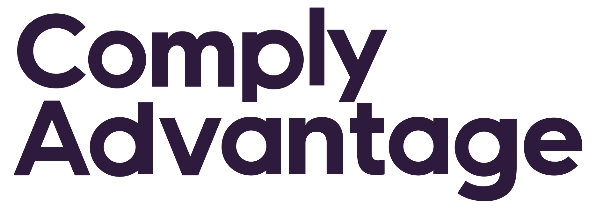

___

## Regulation Technology Company Combating Financial Crime

| [Overview](#overview-and-origin) | [Business Activities](#business-activities) | [Landscape](#landscape) | [Results](#results) | [Recommendations](#recommendations) |

 

___

## Overview and Origin 

**Charles Delingpole** founded **Comply Advantage Ltd** (*also known as ComplyAdvantage*) in 2014. The idea for company came from "... his time as the MLRO of a previous startup he founded (*MarketFinance Limited*) when he realized the ubiquitous inefficiency concerning money laundering processes." (*[Source](https://delingpole.com/about-charles-delingpole)*) 

The company is currently a Series C with total investment funding of =108.2 million US dollars=, according to CrunchBase.com's profile of the company. The notable investors in the Series C round include Goldman Sachs Asset Management, Ontario Teacher's Pension Plan Board, Index Ventures, and Balderton Capital. (*[Source](https://www.crunchbase.com/organization/comply-advantage/company_financials)*) 

<ins>Charles Delingpol, Founder of ComplyAdvantage</ins>

 

___

## Business Activities

ComplyAdvantage is combating and addressing financial crimes by building a global database of KYC (Know Your Customer) profiles that helps financial companies and companies with global transactional activities to monitor customers, process due diligence, screen payments in realtime, and identify potential financial crimes.  Their customers include traditional financial institutions, investment firms, cryptocurrency exchange and e-wallet companies, insurance companies, lenders, and payment processing firms. 

According to founder's website, delingpole.com, the key differentiator and unfair advantage for ComplyAdvantage is their sheer scale of crime risk data spanning more than 650 organizations in 75 countries that serves as the foundation of their risk detection AI technology. This enables them to build "a unified and comprehensive data graph of individuals and business entities. (*[Source](https://delingpole.com/about-charles-delingpole)*)"

ComplyAdvantage currently use TensorFlow as their primary machine learning technology with Kotlin for natural language processing. For data handling, they use Cassandra, Redis and PostgreSQL. Below is a chart of some of their core technologies.
| Machine Learning | Data | User Interface |
| ----------- | ----------- | -------------|
| TensorFlow | Cassandra | Node.js |
| Kotlin | Redis | React |
| Python |  PostgreSQL| AngularJS |
| Flask (Python applications)| Hadoop | Laravel | 

 

___

## Landscape

ComplyAdvantage is in the **Regulatory Technology** sector of the financial industry. The major recent trends around this sector is the sheer growth of legal issues around the growing international transactions as well as the need for companies and institutions to keep up with the ever changing compliance laws administered by different governments across many nations. There are also new financial technologies entering into the global economic landscape such as cryptocurrency. As such, there are also applications of blockchain as a digital ledger to help track and monitor the bad actors. Some of the other major companies in the *regulatory technology* sector includes:
- Chainanalysis
- Forter
- Hummingbird
- Continuity
- Ayasdi
- IdentityMind

 

___

## Results

One of ComplyAdvantage's biggest achievement is their ability to analyze five million new articles across 200 countries and update 30,000 KYC (Know Your Customer) profiles within 24 hours. (*[Source](https://builtin.com/fintech/regtech-companies)*) They have also been able to consistently identify high-risk customers with fewer false-positives and remediate alerts with speed and ease. 

The key core metrics that this company use to measure success are the number of individuals they are able to profile, the number of companies that they have data connections with, the number of facts they have indexed, the number of connections in their data points, and the number of sources for their data and information. According to their website, they have profiled 2 billion individuals, connected to 700 million companies, indexed 100 billion facts, have 500 million connections in their data points, and have access to 20,000 sources. 

ComplyAdvantage is a relatively young startup with approximately 300 employees globally in comparison to their competitors. However, many of their competitors are also primarily young and small scale.

 

___

## Recommendations

One potential product for this company is to service regular retail customers via the financial companies they partner with. The goal is to alert retail customers of any potential scams or illegal activities that they may unknowingly participate in. They can leverage the power of retail customers with the sheer number and their willingness to combat money laundering crime not only on a global scale, but they can also encompass the bad actors with even more prevasive monitoring.

The current technologies ComplyAdvantage utilizes is fairly sufficient at accomplishing this. They may have to collaborate with their corporate accounts to build or implement a user-interface that will service the retail customers directly. Additional technologies may be mobile applications and AI assistants to make product delivery to and interactions with retail customers more seamless.

